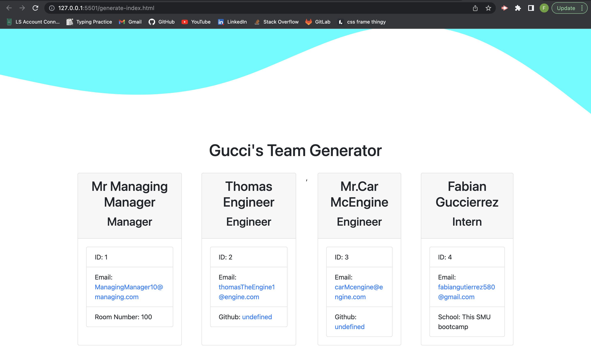

<!-- PROJECT LOGO -->
 

  

  <h1 align="center">Gucci's  Fortune 500 Team Generator</h1>

<!-- ABOUT THE PROJECT -->
## About The Project

With this Node Command-line apllication you'll use inquirer to enter your employees information and generate amazing cards with all the information a head CEO will ever need.(For VIDEO WALKTHROUGH please click on image at top of the screen)

(<a href="#readme-top">back to top</a>)

### Built With

### Installation

* Step 1: Clone repo
* Step 2: Make sure you have Node.js
* Step 3: use "npm i" to install the packages required

(<a href="#readme-top">back to top</a>)

<!-- USAGE EXAMPLES -->
## Usage
To use the app open the terminal, Select proper employee and then enter their information accordingly. Then a team page will be generated that displays everyone's information that was entered 

(<a href="#readme-top">back to top</a>)

<!-- CONTRIBUTING -->
## Contributing

I am the only direct(instructors and tutor helped) contributer to this Repo.

(<a href="#readme-top">back to top</a>)

<!-- LICENSE -->
## License

(<a href="#readme-top">back to top</a>)

<!-- CONTACT -->
## Contact

Fabian Gutierrez - [fabiangutierrez580@gmail.com]
(LinkedIn) - [www.linkedin.com/in/fabian-gutierrez-016523248]

Project Link: [https://github.com/Guccierrez/TeamProfileGenerator]

<!-- ACKNOWLEDGMENTS -->
## Acknowledgments
Again shout out to My instructors, Mr. Edwards and Mr. Andrew. This week I'd also like to thank my tutor Mr. Andres Jimenez.

<!-- MARKDOWN LINKS & IMAGES -->
